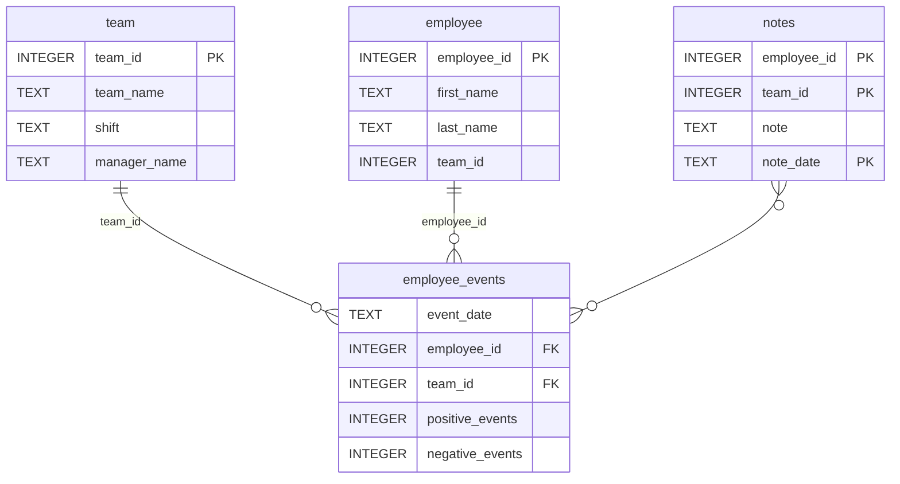

# Dashboard Project

### Business Scenario
Build up dashboard to review employee's positive and negative performance events and their predicted risk of recruitment. It displays an employee's likelihood of recruitment, or a team of employees' average likelihood of recruitment.

### Technical Scenario of this work
Develop SQL queries and a Python package that allows users to generate critical datasets.

### How to Use
1. Install "python-package" by: pip install .\python-package\
2. Run dashboard "report" by: py.\report\dashboard.py

### Repository Structure
```
├── README.md
├── assets
│   ├── model.pkl
│   └── report.css
├── env
├── python-package
│   ├── employee_events
│   │   ├── __init__.py
│   │   ├── employee.py
│   │   ├── employee_events.db
│   │   ├── query_base.py
│   │   ├── sql_execution.py
│   │   └── team.py
│   ├── requirements.txt
│   ├── setup.py
├── report
│   ├── base_components
│   │   ├── __init__.py
│   │   ├── base_component.py
│   │   ├── data_table.py
│   │   ├── dropdown.py
│   │   ├── matplotlib_viz.py
│   │   └── radio.py
│   ├── combined_components
│   │   ├── __init__.py
│   │   ├── combined_component.py
│   │   └── form_group.py
│   ├── dashboard.py
│   └── utils.py
├── requirements.txt
├── start
├── tests
    └── test_employee_events.py
```

### employee_events.db


